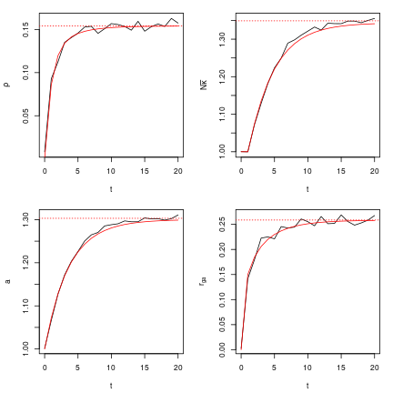

## Installation

The package can be installed directly from github, using either `devtools` or `remotes`:

```R
devtools::install_github("https://github.com/HervePerdry/AMVCTpaper")
```
or 
```R
remotes::install_github("https://github.com/HervePerdry/AMVCTpaper")
```

It can then be loaded with 

``` r
library(AMVCTpaper)
```

### Overview

This package contains a set of functions to calculate the evolution and equilibrium values of quantities of interest
under the AMVTC model (co-occurrence of Assortative Mating and Vertical Cultural Transmission) as described here:
https://www.biorxiv.org/content/10.1101/2023.04.08.536101v3. This includes both theoretical calculations as well as the
simple forward-time simulations detailed in the publication; as well as code to reproduce the main figures therein.

#### Theoretical evolution equations

The evolution of all parameters in the AMVTC model can be estimated with the function pop.evolution() for  a population
which is initially at gametic equilibrium, without assortative mating. The function takes the following arguments

|          | |
|----------|--------------------------------------------------------------------------------------------|
| `g0`     | Standard deviation of gametic value in a population without assortative mating  |
| `e`      | Standard deviation of environmental effects  |
| `r.ho`   | Correlation between mates   |
| `nu`     | Correlation between parents' and offspring environmental effects  |
| `N`      | Number of causal variants, all will have a minor-allele frequency of 0.5 and are unlinked  |
| `nb.gen` | Number of generations  |


The function returns a data frame with class "pop.evolution", with columns 

|           | |
|-----------| ---------------------------------------------------|
| `t`       | the generation, from 0 to nb.gen                   |
| `N.kappa` | the value of $N\overline\kappa(t)$ |
| `g`       | the standard deviation of the gametic value $g(t)$ |
| `r.ga`    | the gametic correlation, $r_ga(t)$   |
| `rho`     | the gene-environment correlation $\rho(t)$ |
| `a`       | the standard deviation of the genetic value $a(t)$ |
| `sigma2`  | the variance of the phenotype, $\sigma^2(t)$ |

Example:


``` r
pop.evolution(g0 = sqrt(0.5), e = 1, r.ho = 0.6, nu = 0.4, N = 1e4, nb.gen = 10)
```

```
## Evolution of a population with parameters :
##           g0            e         r.ho           nu            N 
## 7.071068e-01 1.000000e+00 6.000000e-01 4.000000e-01 1.000000e+04 
## 
##     t  N.kappa         g      r.ga        rho        a   sigma2
## 1   0 1.000000 0.7071068 0.0000000 0.00000000 1.000000 2.000000
## 2   1 1.000000 0.7071068 0.1500000 0.08607737 1.072381 2.334615
## 3   2 1.074993 0.7331414 0.1844841 0.11965463 1.128411 2.543351
## 4   3 1.136646 0.7538719 0.2058256 0.13419146 1.170725 2.684799
## 5   4 1.185287 0.7698333 0.2200194 0.14136424 1.202528 2.786061
## 6   5 1.223023 0.7819921 0.2299400 0.14538415 1.226477 2.860866
## 7   6 1.252109 0.7912359 0.2370940 0.14788161 1.244579 2.917077
## 8   7 1.274473 0.7982710 0.2423556 0.14955031 1.258312 2.959711
## 9   8 1.291659 0.8036352 0.2462754 0.15071946 1.268764 2.992218
## 10  9 1.304866 0.8077331 0.2492212 0.15156363 1.276740 3.017081
## 11 10 1.315017 0.8108689 0.2514488 0.15218498 1.282839 3.036134
```

#### Equilibrium values

While `pop.evolution()` gives the theoretical evolution of all parameters but not the equilibrium values. These are
provided by the function `AMVCT()`, which calculated the theoretical equilibrium values of all parameters in the model, as
well as the resulting correlations between various pairs of genetic and non-genetic components for members of a trio;
described in Tables 1 and 2 in the publication. The function will solve the non-linear system of equations with the
function `solve.a.rho()`. This function has arguments `h2.0`, `g0`, `e`, `r.ho`, and `nu`. The
argument `h2.0` allow to give the value of the heritability in the initial population, without AM and VCT.
All other arguments are similar to the arguments of `pop.evolution`.
The user must provide either `g0` and `e`, or `h2.0`, but not both.

`AMVCT()` returns an object of class `AMVCT`, which is a list with components g0`, `e`, `r.ho`, `nu`, `rho`, `a, `sigma2`,
`r.ga`, `g`, `h2.SNP`, `decompose.sigma2`, `cor.mates` (corresponding to table 1 of the supplementary material)
`cor.parent.offspring` (corresponding to table 2 of the supplementary material) `cor.pheno.parent.offspring` (correlation
of the phenotypes of parent and offspring).

Example:

``` r
AMVCT(g0 = sqrt(0.5), e = 1, r.ho = 0.6, nu = 0.4)
```

```
## Assortative mating and verticulal cultural transmission with parameters
## g0 = 0.7071068 e =  1 r.ho =  0.6 nu = 0.4 
## Corresponding to an heritability without AM and VCT h²_0 = 0.5 
## ----------------------------------------------------------------
## Values at equilibrium:
## Gametic correlation r_ga =  0.2586618 
## Gametic effect g =  0.8212527 or g^2 = 0.674456 
## Total additive effect a = 1.302989 or a^2 =  1.69778 
## Correlation (A, E) rho = 0.1541091 
## Phenotype variance sigma^2 = 3.099385 decomposing as
##             a2.a deux.rho.a.e.rho               e2 
##        1.6977796        0.4016049        1.0000000 
## 
## SNP-heritability h^2_SNP = 0.685018 
## 
## Correlations between mates
##           A1        E1        A2        E2
## A1 1.0000000 0.1541091 0.4110108 0.3387163
## E1 0.1541091 1.0000000 0.3387163 0.2791380
## A2 0.4110108 0.3387163 1.0000000 0.1541091
## E2 0.3387163 0.2791380 0.1541091 1.0000000
## 
## Correlations between parent and offspring
##           A3        E3
## A1 0.7055054 0.1541091
## E1 0.2464127 0.4000000
## 
## Leading to a correlation between parent's and offspring phenotypes = 0.6838997
```

#### Forward time simulations

The evolution of all parameters can also be estimated from a simple simulated population using pop.sim(), with a fixed
size across generations, with both AM and VCT starting in generation zero. Here, we apply a simple model for forming M/2
couples from the population of M individuals, each of which produce exactly 2 offspring in order to form the next
generation; with all individuals having a simulated phenotype value following the AMVCT model. The function takes the
the same arguments as `pop.evolution`, and a few new arguments:

|              | |
|--------------|---------------------|
| pop.size     | Population size  |
| digest       | Logical. Set to `TRUE` to send back only a digest of the results  |
| keep.N.kappa | Logical. Set to `TRUE` to keep trace of $N \overline\kappa(t)$.  |

Beware: setting `keep.N.kappa` to `TRUE` results in lengthy computations.

This function will return, if `digest` is `TRUE`, a data frame similar to the result of `pop.evolution`, with an
additional column for `e` which contain the sd of the environmental components at each generation (this fluctuates
slightly around the value of the corresponding parameter, due to random sampling). If `digest` is `FALSE`, it returns a list with
member `digest` (the digest as described before), `G` (the matrix of genotypes at the last generation), `A` (the genetic
value at the last generation), `E` (the environmental value at the last generation), `P` (the phenotypes at the last
generation).

Example of a forward-time simulation over 20 generations, with N = 100 causal loci and a population of size 25,000:


``` r
R <- pop.sim(g0 = sqrt(0.5), e = 1, r.ho = 0.6, nu = 0.4, pop.size = 25000, N = 100, nb.gen = 20, TRUE, TRUE)
R
```

```
## Evolution of a population with parameters :
##           g0            e         r.ho           nu            N     pop.size 
## 7.071068e-01 1.000000e+00 6.000000e-01 4.000000e-01 1.000000e+02 2.500000e+04 
## 
##     t         e   N.kappa         g        r.ga         rho        a   sigma2
## 1   0 0.9978443 1.0002033 0.7081342 0.002687547 0.008086709 1.001453 2.014763
## 2   1 0.9958316 0.9996871 0.7066189 0.141691102 0.092994689 1.066393 2.326386
## 3   2 0.9947018 1.0723338 0.7354497 0.179576025 0.112383937 1.127129 2.511852
## 4   3 0.9961256 1.1289659 0.7503215 0.222638996 0.135170129 1.171810 2.680965
## 5   4 0.9942443 1.1816699 0.7643415 0.225066979 0.140618039 1.203034 2.772202
## 6   5 0.9993847 1.2236242 0.7781885 0.221149900 0.145837717 1.226106 2.859510
## 7   6 0.9989157 1.2492657 0.7907026 0.245540251 0.152863226 1.250360 2.943087
## 8   7 0.9949351 1.2895400 0.8026306 0.242817971 0.153724923 1.264667 2.976130
## 9   8 0.9920930 1.2981421 0.8071240 0.244507209 0.145535326 1.270292 2.964712
## 10  9 0.9984549 1.3106641 0.8111056 0.260831827 0.150994479 1.285361 3.036632
## 11 10 1.0011621 1.3214262 0.8090670 0.255355188 0.156840174 1.288208 3.066362
## 12 11 0.9980680 1.3324161 0.8092776 0.247227613 0.155759455 1.290352 3.062340
## 13 12 0.9991939 1.3242578 0.8112870 0.265667938 0.153546604 1.296997 3.078569
## 14 13 0.9996820 1.3426345 0.8147729 0.251334796 0.149212251 1.295061 3.062902
## 15 14 0.9964467 1.3414206 0.8158190 0.251970695 0.159525636 1.295026 3.081709
## 16 15 1.0026782 1.3413413 0.8195296 0.268825636 0.148022161 1.303870 3.092479
## 17 16 0.9947425 1.3482273 0.8193946 0.255659895 0.153308552 1.301591 3.080644
## 18 17 0.9993475 1.3482076 0.8215186 0.248450226 0.156463231 1.302164 3.101542
## 19 18 0.9972935 1.3438590 0.8214858 0.252884112 0.153541636 1.298823 3.079303
## 20 19 0.9991713 1.3500172 0.8188860 0.258389400 0.162839478 1.302259 3.117988
## 21 20 0.9977963 1.3552811 0.8221391 0.267595256 0.157455273 1.310833 3.125767
```

We can plot a comparison to the theoretical evolution values of `pop.evolution()` and equilibrium values of `AMVCT()`:

``` r
ev <- pop.evolution(g0 = sqrt(0.5), e = 1, r.ho = 0.6, nu = 0.4, N = 100, nb.gen = 20) 
limits <- AMVCT(g0 = sqrt(0.5), e = 1, r.ho = 0.6, nu = 0.4)

par(mfrow=c(2,2), cex = .7, mai = c(3,3,1,1)/5)
## plotting evolution of rho
plot(R$t, R$rho, type = "l", xlab = "t", ylab = expression(rho))
lines(ev$t, ev$rho, col = "red")
abline(h = limits$rho, col = "red", lty = 3)

## plotting evolution of N kappa bar
plot(R$t, R$N.kappa, type = "l", xlab = "t", ylab = expression(N * bar(kappa)))
lines(ev$t, ev$N.kappa, col = "red")
abline(h = 1/(1-limits$r.ga), col = "red", lty = 3)

## plotting evolution of a
plot(R$t, R$a, type = "l", xlab = "t", ylab = "a") 
lines(ev$t, ev$a, col = "red")
abline(h = limits$a, col = "red", lty = 3)

## plotting evolution of r.ga
plot(R$t, R$r.ga, type = "l", xlab = "t", ylab = expression(r[ga]))
lines(ev$t, ev$r.ga, col =" red")
abline(h = limits$r.ga, col = "red", lty = 3)
```



#### Recreating the plots in the article

The directory `figures/` contains instruction and script fpr
reproducing all figures in the paper.

Running `simus-50.r` will re-generate the files `simus-50-N1000-pop100k.rds` and `simus-50-N1000-pop25k.rds` 
that are needed for some of the figures.

Running `figures-AMVCT-paper.r` will generate the figures.

The files `multiple.pop.sim.r`, `fig.evol.r` and `fig.nu.r` contain functions definition that 
are needed by `simus-50.r` and `figures-AMVCT-paper.r`.
