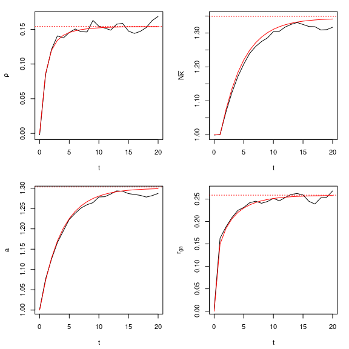

## Installation

The package can be installed directly from github, using either
`devtools` or `remotes`:

``` r
devtools::install_github("https://github.com/HervePerdry/AMVCTpaper")
```

or

``` r
remotes::install_github("https://github.com/HervePerdry/AMVCTpaper")
```

It can then be loaded with

``` r
library(AMVCTpaper)
```

### Overview

This package contains a set of functions to calculate the evolution and
equilibrium values of quantities of interest under the AMVTC model
(co-occurrence of Assortative Mating and Vertical Cultural Transmission)
as described here:
<https://www.biorxiv.org/content/10.1101/2023.04.08.536101v3>. This
includes both theoretical calculations as well as the simple
forward-time simulations detailed in the publication; as well as code to
reproduce the main figures therein.

#### Theoretical evolution equations

The evolution of all parameters in the AMVTC model can be estimated with
the function pop.evolution() for a population which is initially at
gametic equilibrium, without assortative mating. The function takes the
following arguments

|          |                                                                                           |
| -------- | ----------------------------------------------------------------------------------------- |
| `g0`     | Standard deviation of gametic value in a population without assortative mating            |
| `e`      | Standard deviation of environmental effects                                               |
| `r.ho`   | Correlation between mates                                                                 |
| `nu`     | Correlation between parents’ and offspring environmental effects                          |
| `N`      | Number of causal variants, all will have a minor-allele frequency of 0.5 and are unlinked |
| `nb.gen` | Number of generations                                                                     |

The function returns a data frame with class “pop.evolution”, with
columns

|           |                                                                                                                                                                         |
| --------- | ----------------------------------------------------------------------------------------------------------------------------------------------------------------------- |
| `t`       | the generation, from 0 to nb.gen                                                                                                                                        |
| `N.kappa` | the value of ") |
| `g`       | the standard deviation of the gametic value ")                       |
| `r.ga`    | the gametic correlation, ")                                |
| `rho`     | the gene-environment correlation ")                     |
| `a`       | the standard deviation of the genetic value ")                       |
| `sigma2`  | the variance of the phenotype, ")         |

Example:

``` r
pop.evolution(g0 = sqrt(0.5), e = 1, r.ho = 0.6, nu = 0.4, N = 1e4, nb.gen = 10)
```

    ## Evolution of a population with parameters :
    ##           g0            e         r.ho           nu            N 
    ## 7.071068e-01 1.000000e+00 6.000000e-01 4.000000e-01 1.000000e+04 
    ## 
    ##     t  N.kappa         g      r.ga        rho        a   sigma2
    ## 1   0 1.000000 0.7071068 0.0000000 0.00000000 1.000000 2.000000
    ## 2   1 1.000000 0.7071068 0.1500000 0.08607737 1.072381 2.334615
    ## 3   2 1.074993 0.7331414 0.1844841 0.11965463 1.128411 2.543351
    ## 4   3 1.136646 0.7538719 0.2058256 0.13419146 1.170725 2.684799
    ## 5   4 1.185287 0.7698333 0.2200194 0.14136424 1.202528 2.786061
    ## 6   5 1.223023 0.7819921 0.2299400 0.14538415 1.226477 2.860866
    ## 7   6 1.252109 0.7912359 0.2370940 0.14788161 1.244579 2.917077
    ## 8   7 1.274473 0.7982710 0.2423556 0.14955031 1.258312 2.959711
    ## 9   8 1.291659 0.8036352 0.2462754 0.15071946 1.268764 2.992218
    ## 10  9 1.304866 0.8077331 0.2492212 0.15156363 1.276740 3.017081
    ## 11 10 1.315017 0.8108689 0.2514488 0.15218498 1.282839 3.036134

#### Equilibrium values

While `pop.evolution()` gives the theoretical evolution of all
parameters but not the equilibrium values. These are provided by the
function `AMVCT()`, which calculated the theoretical equilibrium values
of all parameters in the model, as well as the resulting correlations
between various pairs of genetic and non-genetic components for members
of a trio; described in Tables 1 and 2 in the publication. The function
will solve the non-linear system of equations with the function
`solve.a.rho()`. This function has arguments `h2.0`, `g0`, `e`, `r.ho`,
and `nu`. The argument `h2.0` allow to give the value of the
heritability in the initial population, without AM and VCT. All other
arguments are similar to the arguments of `pop.evolution`. The user must
provide either `g0` and `e`, or `h2.0`, but not both.

`AMVCT()` returns an object of class `AMVCT`, which is a list with
components g0`,`e`,`r.ho`,`nu`,`rho`,`a, `sigma2`, `r.ga`, `g`,
`h2.SNP`, `decompose.sigma2`, `cor.mates` (corresponding to table 1 of
the supplementary material) `cor.parent.offspring` (corresponding to
table 2 of the supplementary material) `cor.pheno.parent.offspring`
(correlation of the phenotypes of parent and offspring).

Example:

``` r
AMVCT(g0 = sqrt(0.5), e = 1, r.ho = 0.6, nu = 0.4)
```

    ## Assortative mating and verticulal cultural transmission with parameters
    ## g0 = 0.7071068 e =  1 r.ho =  0.6 nu = 0.4 
    ## Corresponding to an heritability without AM and VCT h²_0 = 0.5 
    ## ----------------------------------------------------------------
    ## Values at equilibrium:
    ## Gametic correlation r_ga =  0.2586618 
    ## Gametic effect g =  0.8212527 or g^2 = 0.674456 
    ## Total additive effect a = 1.302989 or a^2 =  1.69778 
    ## Correlation (A, E) rho = 0.1541091 
    ## Phenotype variance sigma^2 = 3.099385 decomposing as
    ##             a2.a deux.rho.a.e.rho               e2 
    ##        1.6977796        0.4016049        1.0000000 
    ## 
    ## SNP-heritability h^2_SNP = 0.685018 
    ## 
    ## Correlations between mates
    ##           A1        E1        A2        E2
    ## A1 1.0000000 0.1541091 0.4110108 0.3387163
    ## E1 0.1541091 1.0000000 0.3387163 0.2791380
    ## A2 0.4110108 0.3387163 1.0000000 0.1541091
    ## E2 0.3387163 0.2791380 0.1541091 1.0000000
    ## 
    ## Correlations between parent and offspring
    ##           A3        E3
    ## A1 0.7055054 0.1541091
    ## E1 0.2464127 0.4000000
    ## 
    ## Leading to a correlation between parent's and offspring phenotypes = 0.6838997

#### Forward time simulations

The evolution of all parameters can also be estimated from a simple
simulated population using pop.sim(), with a fixed size across
generations, with both AM and VCT starting in generation zero. Here, we
apply a simple model for forming M/2 couples from the population of M
individuals, each of which produce exactly 2 offspring in order to form
the next generation; with all individuals having a simulated phenotype
value following the AMVCT model. The function takes the the same
arguments as `pop.evolution`, and a few new arguments:

|              |                                                                                                                                                                                                          |
| ------------ | -------------------------------------------------------------------------------------------------------------------------------------------------------------------------------------------------------- |
| pop.size     | Population size                                                                                                                                                                                          |
| digest       | Logical. Set to `TRUE` to send back only a digest of the results                                                                                                                                         |
| keep.N.kappa | Logical. Set to `TRUE` to keep trace of "). |

Beware: setting `keep.N.kappa` to `TRUE` results in lengthy
computations.

This function will return, if `digest` is `TRUE`, a data frame similar
to the result of `pop.evolution`, with an additional column for `e`
which contain the sd of the environmental components at each generation
(this fluctuates slightly around the value of the corresponding
parameter, due to random sampling). If `digest` is `FALSE`, it returns a
list with member `digest` (the digest as described before), `G` (the
matrix of genotypes at the last generation), `A` (the genetic value at
the last generation), `E` (the environmental value at the last
generation), `P` (the phenotypes at the last generation).

Example of a forward-time simulation over 20 generations, with N = 100
causal loci and a population of size 25,000:

``` r
R <- pop.sim(g0 = sqrt(0.5), e = 1, r.ho = 0.6, nu = 0.4, pop.size = 25000, N = 100, nb.gen = 20, TRUE, TRUE)
R
```

    ## Evolution of a population with parameters :
    ##           g0            e         r.ho           nu            N     pop.size 
    ## 7.071068e-01 1.000000e+00 6.000000e-01 4.000000e-01 1.000000e+02 2.500000e+04 
    ## 
    ##     t         e   N.kappa         g        r.ga         rho        a   sigma2
    ## 1   0 1.0046175 0.9994561 0.7083622 0.004212566 -0.00209401 1.001776 2.008596
    ## 2   1 0.9975844 1.0010411 0.7056079 0.162805198  0.08467845 1.076241 2.335299
    ## 3   2 0.9946252 1.0675193 0.7281035 0.187968203  0.12097855 1.125365 2.526552
    ## 4   3 1.0006847 1.1246754 0.7495059 0.208703164  0.14059191 1.166307 2.689812
    ## 5   4 0.9997044 1.1715864 0.7636955 0.224631020  0.13756505 1.194984 2.756075
    ## 6   5 0.9977136 1.2083313 0.7784626 0.231335154  0.14546394 1.223222 2.846761
    ## 7   6 0.9983779 1.2400448 0.7885764 0.241754670  0.15048300 1.238271 2.902146
    ## 8   7 1.0001800 1.2601022 0.7982414 0.245071687  0.14656659 1.251459 2.933420
    ## 9   8 1.0007757 1.2748353 0.7974536 0.240632446  0.14618597 1.259350 2.956000
    ## 10  9 0.9965479 1.2855550 0.8030885 0.244477838  0.16282808 1.264505 3.002454
    ## 11 10 0.9999782 1.3040237 0.8072035 0.251513842  0.15442089 1.278534 3.029462
    ## 12 11 0.9969806 1.3050643 0.8108125 0.246045047  0.15178799 1.279118 3.017251
    ## 13 12 1.0015661 1.3175381 0.8084143 0.253386806  0.14884453 1.285742 3.039617
    ## 14 13 0.9925818 1.3253897 0.8170248 0.260239697  0.15742158 1.293483 3.062540
    ## 15 14 1.0056141 1.3308973 0.8193129 0.262343093  0.15859218 1.292527 3.094155
    ## 16 15 0.9968224 1.3249987 0.8146962 0.259090377  0.14744061 1.286768 3.027665
    ## 17 16 0.9854874 1.3191248 0.8102248 0.244893022  0.14413855 1.284612 2.986363
    ## 18 17 0.9933261 1.3185019 0.8113226 0.238956216  0.14708645 1.282405 3.005991
    ## 19 18 1.0034091 1.3089702 0.8077595 0.252706165  0.15261914 1.278255 3.032269
    ## 20 19 1.0044336 1.3098450 0.8111342 0.253923309  0.16268999 1.281803 3.070828
    ## 21 20 0.9959618 1.3168476 0.8124049 0.268197736  0.16868234 1.287233 3.081423

We can plot a comparison to the theoretical evolution values of
`pop.evolution()` and equilibrium values of `AMVCT()`:

``` r
ev <- pop.evolution(g0 = sqrt(0.5), e = 1, r.ho = 0.6, nu = 0.4, N = 100, nb.gen = 20) 
limits <- AMVCT(g0 = sqrt(0.5), e = 1, r.ho = 0.6, nu = 0.4)

par(mfrow=c(2,2), cex = .7, mai = c(3,3,1,1)/5)
## plotting evolution of rho
plot(R$t, R$rho, type = "l", xlab = "t", ylab = expression(rho))
lines(ev$t, ev$rho, col = "red")
abline(h = limits$rho, col = "red", lty = 3)

## plotting evolution of N kappa bar
N.kappa.lim <- 1/(1-limits$r.ga)
plot(R$t, R$N.kappa, type = "l", xlab = "t", ylab = expression(N * bar(kappa)), 
     ylim = c(1, max(N.kappa.lim, R$N.kappa)))
lines(ev$t, ev$N.kappa, col = "red")
abline(h = N.kappa.lim, col = "red", lty = 3)

## plotting evolution of a
plot(R$t, R$a, type = "l", xlab = "t", ylab = "a") 
lines(ev$t, ev$a, col = "red")
abline(h = limits$a, col = "red", lty = 3)

## plotting evolution of r.ga
plot(R$t, R$r.ga, type = "l", xlab = "t", ylab = expression(r[ga]))
lines(ev$t, ev$r.ga, col =" red")
abline(h = limits$r.ga, col = "red", lty = 3)
```

<!-- -->

#### Recreating the plots in the article

The directory `figures/` contains instruction and script fpr reproducing
all figures in the paper.

Running `simus-50.r` will re-generate the files
`simus-50-N1000-pop100k.rds` and `simus-50-N1000-pop25k.rds` that are
needed for some of the figures.

Running `figures-AMVCT-paper.r` will generate the figures.

The files `multiple.pop.sim.r`, `fig.evol.r` and `fig.nu.r` contain
functions definition that are needed by `simus-50.r` and
`figures-AMVCT-paper.r`.
